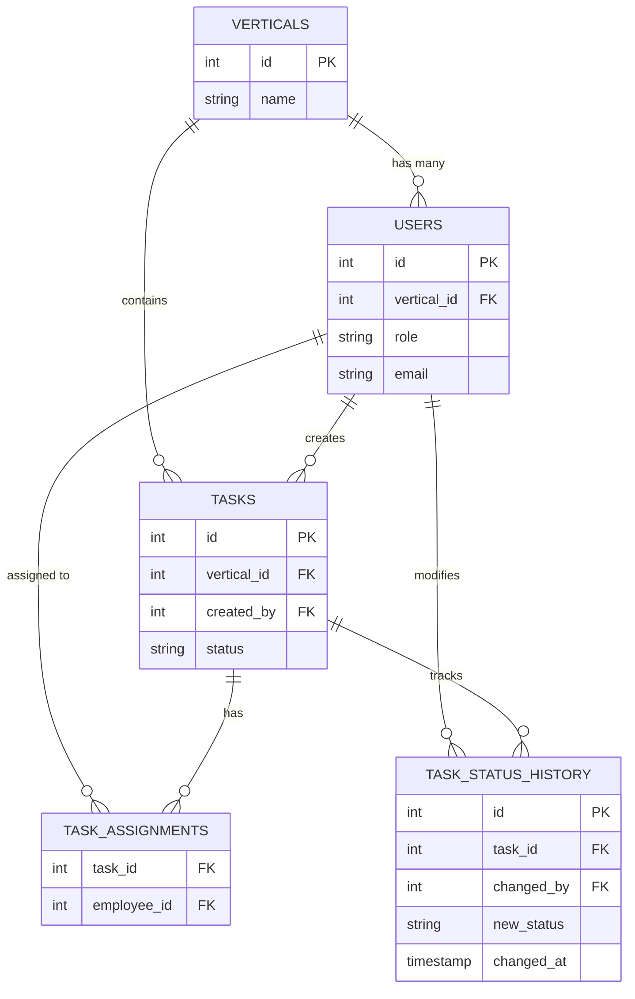

# Task and Delegation Management System
## Database Architecture & Workflow Plan

By introducing 8 Verticals (Departments/Divisions), we can isolate data so that employees and managers only see what is relevant to their specific vertical, enhancing both security and efficiency.

### 1. Recommended Database: PostgreSQL
For a Role-Based Access Control (RBAC) system with task tracking and workflow management, a **Relational Database Management System (RDBMS)** is the best choice. **PostgreSQL** (or MySQL) is highly recommended for the following reasons:
*   **Structured Relationships:** Your operations involve clear relationships (Users belong to Verticals, Tasks are assigned to Users, Tasks have multiple Status updates). RDBMS handles these connections natively.
*   **Data Integrity & ACID Compliance:** Ensures status updates are reliably saved and timestamped without data corruption.
*   **Scalability for Phase 2:** PostgreSQL is exceptionally powerful for generating complex aggregation queries, which is essential when building Reports & Analytics features later.

---

### 2. Enhanced Workflow & Standards

By introducing Verticals, the workflow should be standardized to prevent data overlap:

*   **Vertical Isolation:** 
    *   **Employees** only see tasks assigned to them within their Vertical.
    *   **Co-Admins** only see tasks, users, and progress specific to *their* assigned Vertical.
*   **Global Admin vs. Vertical Admin:** 
    *   **Global Admin** oversees all 8 verticals, creates Verticals, and assigns users across the company.
    *   **Vertical Admin** has full "Admin" rights, but only restricted to their specific Vertical.
*   **Workflow Standard Check:** When creating a Task, the logic should automatically inherit the creator's Vertical. A Co-Admin in the "Sales" vertical cannot accidentally assign a task to an Employee in the "Operations" vertical.

---

### 3. Database Schema

#### `verticals`
Stores the 8 organizational verticals.
* `id` (UUID / INT, Primary Key)
* `name` (VARCHAR): Name of the vertical
* `created_at` (TIMESTAMP)

#### `users`
Stores all Admins, Co-Admins, and Employees.
* `id` (UUID / INT, Primary Key)
* `vertical_id` (UUID / INT, Foreign Key) 
* `first_name` (VARCHAR)
* `email` (VARCHAR, Unique)
* `password_hash` (VARCHAR)
* `role` (ENUM): 'GLOBAL_ADMIN', 'ADMIN', 'CO_ADMIN', 'EMPLOYEE'
* `is_active` (BOOLEAN)

#### `tasks`
Stores the core details of the tasks.
* `id` (UUID / INT, Primary Key)
* `vertical_id` (UUID / INT, Foreign Key)
* `created_by` (UUID / INT, Foreign Key)
* `title` (VARCHAR)
* `description` (TEXT)
* `priority` (ENUM): 'LOW', 'MEDIUM', 'HIGH'
* `status` (ENUM): 'CREATED', 'ASSIGNED', 'IN_PROGRESS', 'COMPLETED', 'REVIEWED', 'REWORK'
* `due_date` (TIMESTAMP)

#### `task_assignments`
Bridge table to allow tasks to be assigned to one or multiple Employees.
* `task_id` (UUID / INT, Foreign Key)
* `employee_id` (UUID / INT, Foreign Key)
* `assigned_at` (TIMESTAMP)

#### `task_status_history`
Records every status change with a timestamp.
* `id` (UUID / INT, Primary Key)
* `task_id` (UUID / INT, Foreign Key)
* `changed_by` (UUID / INT, Foreign Key)
* `old_status` (ENUM)
* `new_status` (ENUM)
* `changed_at` (TIMESTAMP)

---

### 4. Entity-Relationship Graph

